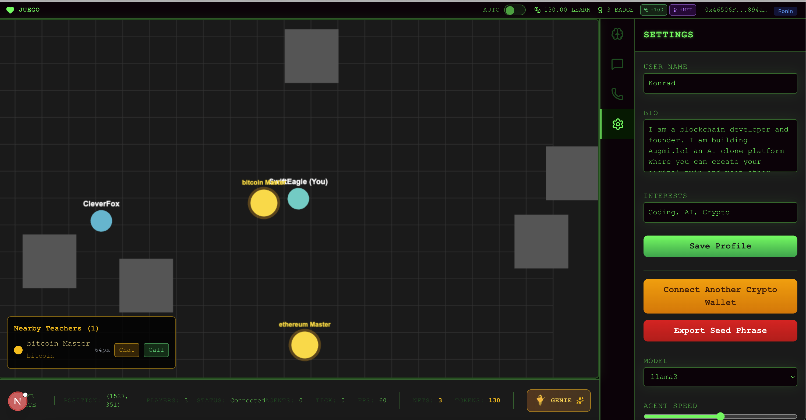
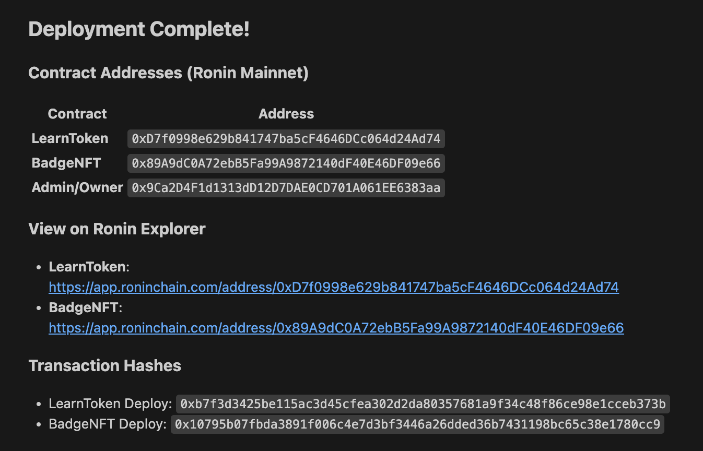
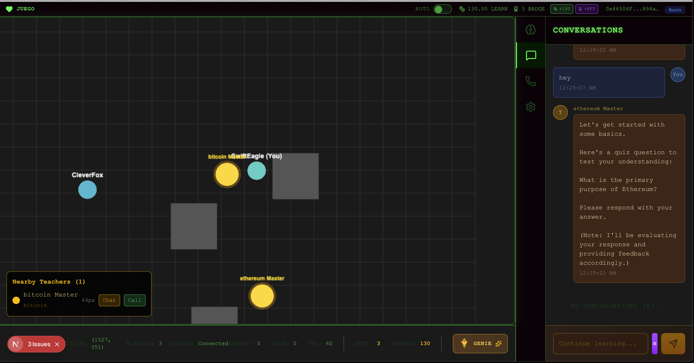
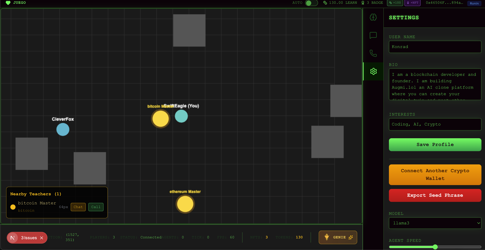

Juego - Technical Implementation Plan
Goal: Build MVP in 48 hours for ETHGlobal Buenos Aires hackathon

Deployment Complete!
Contract Addresses (Ronin Mainnet)
Contract	Address
LearnToken	0xD7f0998e629b841747ba5cF4646DCc064d24Ad74
BadgeNFT	0x89A9dC0A72ebB5Fa99A9872140dF40E46DF09e66
Admin/Owner	0x9Ca2D4F1d1313dD12D7DAE0CD701A061EE6383aa
View on Ronin Explorer
LearnToken: https://app.roninchain.com/address/0xD7f0998e629b841747ba5cF4646DCc064d24Ad74
BadgeNFT: https://app.roninchain.com/address/0x89A9dC0A72ebB5Fa99A9872140dF40E46DF09e66
Transaction Hashes
LearnToken Deploy: 0xb7f3d3425be115ac3d45cfea302d2da80357681a9f34c48f86ce98e1cceb373b
BadgeNFT Deploy: 0x10795b07fbda3891f006c4e7d3bf3446a26dded36b7431198bc65c38e1780cc9
Verification
Both contracts are verified on Ronin Sourcify.
Next Steps
Update your backend .env or contracts.json with the new mainnet addresses to connect your application to these deployed contracts.

# Tech Stack

## Frontend
- **Framework**: Next.js 14 (App Router)
- **UI**: shadcn/ui + Tailwind CSS
- **Wallet**: Ronin Wallet Integration

## Backend
- **Runtime**: Node.js (Bun for speed)
- **Framework**: Hono (lightweight)
- **Smart Contracts**: Solidity + Hardhat

## Blockchain
- **Network**: Ronin Mainnet
- **Smart Contracts**: Solidity + Hardhat
- **RPC**: Ronin public RPC

Storage & Infrastructure

Filecoin: Synapse SDK (knowledge base uploads)
File Processing: PDF parsing (pdf-parse), text extraction
Embeddings: OpenAI text-embedding-3-small
Database: PostgreSQL (Neon serverless)
Hosting: Railway (backend) / Vercel (frontend)

---

Juego Quest video demo
[Watch Demo Video](https://www.youtube.com/watch?v=0gSyJhtMJ1E)

### Project Screenshots

---

Juego Quest
An onchain educational game, AI personal teacher rewards you with $LEARN tokens and NFTs

[Live Demo](https://ethglobal.com/showcase/undefined-i67n8)
[Source Code](https://github.com/konradgnat/juego)

### Created At
ETHGlobal Buenos Aires

### Project Description
An onchain educational game, explore a world, tell your genie what you want to learn, then a teacher appears, have a conversation with them, they will test your knowledge and reward you with $LEARN tokens and special reward NFTs for quality responses. A genie will summon the right teacher for you, it can be a historical or fictional character. They become part of the world and others will be able to discover them and ask them questions. For example: Ethereum, then they will summon the Ethereum master like Vitalik. Vitalik will appear and give you one on one mentorship and test your knowledge.

### How it's Made
The game is a multiplayer live 2D world, where you can walk around and chat with other players and AI teachers. I used socket io for the networking to make the game multiplayer, as all the players in the game can be visible on the world. I used mongodb atlas for the database. Hardhat to test, run locally and deploy the smart contracts. Ronin blockchain. Hardhat. Pixi v8 game engine. TogetherAI LLM. Sign in with Ethereum Ronin wallet. NextJS. Mongodb.

---
